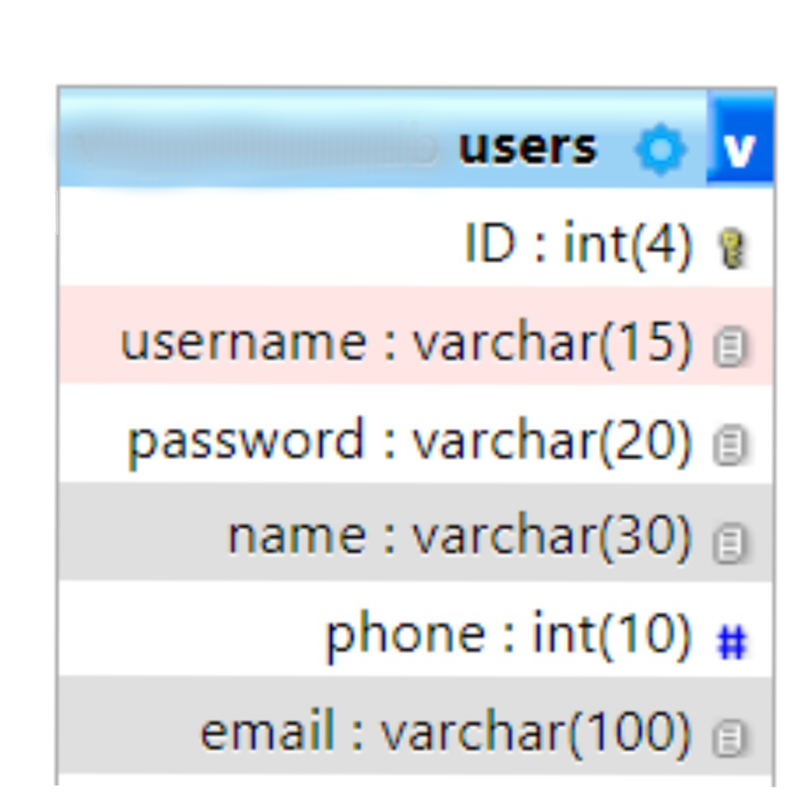

# OOP User Registration System using PHP

This project is an Object-Oriented PHP system for user registration, including features for signing up new users, logging in, and logging out. It is built using PDO for database connection and operations, ensuring a secure and efficient way to interact with the database.

## Features

- User Registration
- User Login
- User Logout
- Database Connection using PDO
- Session Management

## Getting Started

### Prerequisites

- PHP 7.4 or higher
- MySQL Database
- Web Server (e.g., Apache, Nginx)

### Installation

1. Clone the repository to your local machine or web server document root.
2. Create a MySQL database named `DB`.
3. Import the SQL schema provided in the `database.sql` file (not provided in the code snippets but assumed to be part of the project).
4. Configure your web server to serve the project directory.

### Configuration

Edit the `DBconnection.php` file to match your database credentials:

```php
private $host = 'localhost';
private $user = 'root';
private $password = '';
private $DBname = 'DB';
```

## Usage

### Database Connection

The `DBconnection.php` class is responsible for establishing a connection with the MySQL database using PDO.

```php
class DBconnection {
    ...
    public function connect() {
        ...
    }
}
```

### User Registration

Users can register through the `SignUp.php` script. It checks if the user or email already exists in the database; if not, it adds the new user.

```php
require "session.php";
require "UsersRepository.php";

session::startSession();

...
```

### Session Management

The `session.php` abstract class handles session operations, including starting a session, setting session variables, and checking login status.

```php
abstract class Session {
    ...
}
```

### User Repository

The `UsersRepository.php` class contains methods for user operations like adding a new user, checking if a user or email exists, and matching usernames with passwords.

```php
require "database/DBconnection.php";

class UsersRepository {
    ...
}
```

## Security

- Passwords are hashed using `password_hash()` before storing them in the database.
- PDO is used for database operations to prevent SQL injection attacks.
- Sessions are used for tracking login state, enhancing security and user experience.

## Visual Aids

### Database Schema



